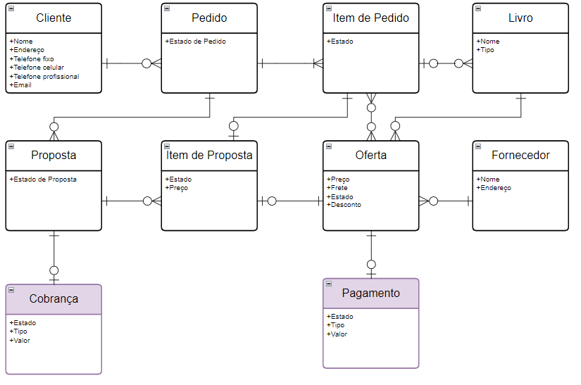

A fim de estimar o esforço necessário para implementar o sistema da Livraria Resolve, foi feito o cálculo aproximado dos pontos de função do mesmo.

Inicialmente, foi montado um diagrama ER (Entidade-Relacionamento) simples para modelar os dados presentes no sistema e sua interação com o sistema ERP já instalado na empresa. O diagrama é simples no sentido de não incluir tabelas que normalmente existiriam no lugar de atributos (endereço, email, telefone, tipos de estados).

- Um cliente pode ter vários pedidos, já finalizados ou não.
- Pedidos são compostos por um ou mais itens de pedidos.
- Itens de pedidos podem ser satisfeitos por um único livro, um livro de um grupo ou nenhum livro.
- Um fornecedor pode possuir ofertas de interesse, que são registradas no sistema
- Ofertas são livros disponíveis para venda por um fornecedor, os quais podem satisfazer itens de pedidos de clientes. Da mesma forma, um item de pedido ser satisfeito por uma lista de ofertas.
- Da lista de ofertas que satisfazem o item de pedido, um é selecionado como item de proposta para compor a proposta feita ao cliente.
- A proposta, se aceita, terá uma cobrança atrelada, assim como cada oferta referente aos itens de proposta terão um pagamento a ser feito ao fornecedor. Estas transferências são manejadas pela seção financeira do sistema ERP da empresa, os quais deve ser acessados pelo sistema a ser desenvolvido.

A partir do diagrama, é possível identificar os Arquivos Lógicos Internos e Arquivos de Interface Externa.
- As entidades claramente independentes no diagrama são Cliente, Livro e Fornecedor, cada um contando um ALI.
- Pedido é composto por itens de pedido, com ambos formando um só ALI.
- Igualmente, Proposta é composta itens de proposta, formando um só ALI.
- Oferta é o arquivo mais complexo do sistema, com a maior capacidade de relações, mas só necessita estar ligado a um fornecedor, formando também um ALI.
- Cobrança e Pagamento, embora sejam duas tabelas diferentes, ambas podem ser vistas como transferências bancárias e também fazem parte do mesmo sistema externo, contando como um só AIE.

Para cada um dos ALIs, podemos supor o número de entradas, saídas e consultas com base nas ações do operador, este sendo o cliente ou um funcionário da empresa.

Ações do Cliente:
- Cliente: Cadastrar, atualizar dados
	- 2 Entradas
- Pedido:  Criar pedido, cancelar pedido, Listar Pedidos do cliente.
	- 1 Entrada
	- 2 Saídas (Cancelar gera uma notificação para funcionários, listar somente pedidos deste cliente)
- Livro:   Visualizar catálogo da empresa por adições mais recentes Visualizar catálogo por tipo
	- 2 Saídas
- Proposta: Visualizar proposta de um pedido, visulizar estado de itens da proposta.
	- 2 Saídas

Ações de funcionários
- Cliente: Aprovar ou rejeitar cliente, Classificar cliente, Consultar, Buscar com base em classificação.
	- 2 Entradas
	- 1 Consulta
	- 1 Saída
- Pedido: Visualizar por estado ou por tarefas a cumprir. Notificação de atraso em andamento.
	- 3 Saídas
- Livro: Registrar livro, Atualizar dados, Consultar livros, Buscar por gênero/tipo
	- 2 Entradas
	- 1 Consulta
	- 1 Saída
- Fornecedor: Registrar fornecedor, Atualizar dados, Consulta, Buscar por localidade
	- 2 Entradas
	- 1 Consulta 
	- 1 Saída
- Oferta: Registrar oferta, Atualizar oferta, Visualizar ofertas atendendo um item de pedido, Referenciar pagamento
	- 3 Entradas
	- 1 Saída
- Proposta: Registrar proposta, Atualizar Proposta, Referenciar Cobrança, Associar oferta a item de proposta
	- 4 Entradas

As ações ligadas às tabelas cobrança e pagamento estão inclusas nas ações de funcionários para as tabelas Oferta e Proposta.

Dado estes elementos (ALIs, AIEs, EEs, SEs e CEs), supõe-se que as telas e formulários associados possuem complexidade simples ou média. Assim, calculam-se os pontos de função para ambas as complexidades para todos os elementos, com o intuito de obter uma quantidade mínima e máxima de pontos de função.
- 6 ALIs por 7 a 10 PFs.
- 1 AIE por 5 a 7 PFs
- 16 EEs por 3 a 4 PFs
- 13 SEs por 4 a 5 PFs
- 3 CEs por 3 a 4 PFs

Resultando entre 156 a 208 PFs para o sistema idealizado da Livraria Resolve.

